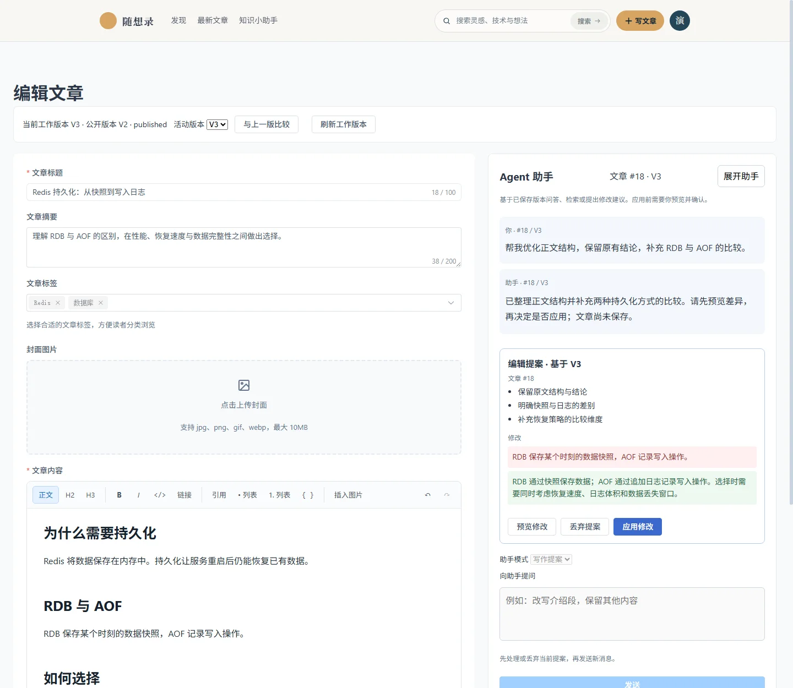
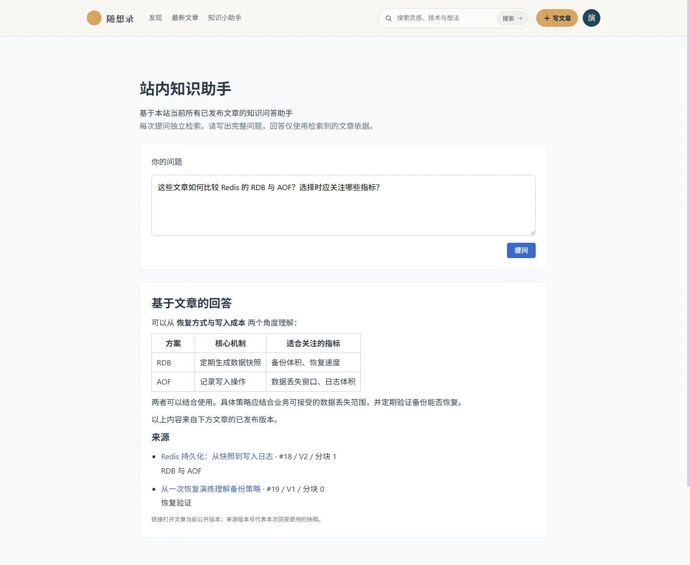
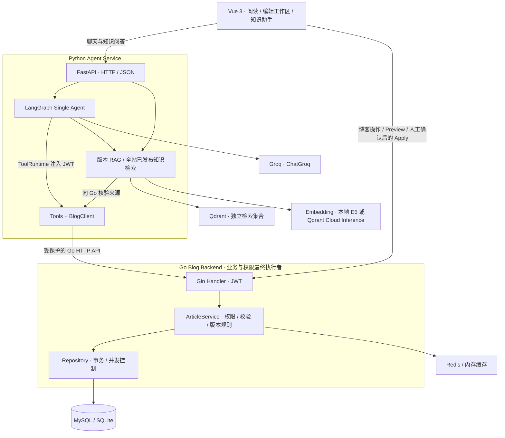
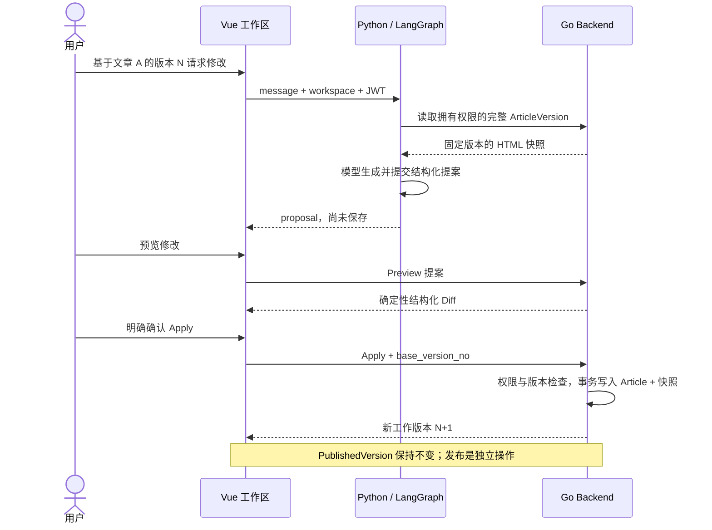

# 随想录 · Blog Agent

**个人知识与内容智能体平台 · Agentic Knowledge & Content Platform**

在一个可阅读、可写作的博客中，实践 Single Agent、Tool Calling、版本化 RAG 与人工批准：助手可以基于文章快照回答问题、提出修改建议；用户预览差异并确认后，由 Go 后端执行最终业务操作。

**Vue 3 · Go / Gin / GORM · Python / FastAPI / LangGraph · Groq · Qdrant**

[功能概览](#功能概览) · [界面展示](#界面展示) · [系统架构](#系统架构) · [快速开始](#快速开始) · [开发文档](#开发文档)


> 文档截图来自当前前端的本地浏览器渲染。账号、文章、回答和提案均使用虚构演示数据与模拟接口，用于展示交互；不包含 Production 数据，也不代表真实模型生成质量或生产链路验证结果。

## 功能概览

| 能力 | 当前实现 |
| --- | --- |
| 博客与写作 | 文章阅读、搜索、标签、评论、点赞、收藏，以及 Tiptap HTML 编辑器 |
| 文章版本 | 内容变更生成不可变 `ArticleVersion` 快照；文章更新与快照写入同一事务 |
| 草稿与发布 | Draft / Publish / Archive；工作版本 `Version` 与公开版本 `PublishedVersion` 分离 |
| 版本比较 | 确定性的 HTML 结构化 Diff，支持同一篇文章的非相邻历史版本比较，不调用 LLM |
| 编辑工作区 | 历史版本选择、版本问答、写作提案、差异预览与明确的人工确认 |
| Single Agent | LangGraph + Groq，通过工具调用 Go API；JWT 由 Runtime Context 注入 |
| 两种知识检索 | 作者拥有的指定历史版本检索；面向全站当前已发布文章的知识问答 |
| 运行保护 | 版本冲突检查、按登录用户限流、受控错误响应、脱敏的请求与提案阶段日志 |

### 版本是内容的边界

文章正文保存为 **Tiptap HTML**，不是 Markdown。版本快照包含 `Title`、`Content`、`Summary`、`CoverImage`，不包含 Status、Tags 或浏览/互动计数。

例如，工作版本已经编辑到 **V8**，公开版本仍可以是 **V6**。保存草稿或应用提案不会把 V8 自动公开，只有明确发布才更新公开版本指针。

HTML 分块识别标题、段落、列表、引用和代码等结构。Diff 比较规范化后的语义块；初版不做完整的富文本样式差异，格式或属性变化可能没有结构化差异，但原始 HTML 不同仍可能产生新版本。

## 界面展示

### 文章工作区与写作提案

编辑器与助手位于同一页面，工作区明确绑定文章及版本。助手读取已保存的完整快照，生成完整 HTML 提案；用户先查看差异，再决定是否应用。



提案不会随工作区切换而自动改变身份。未保存的本地编辑、版本不匹配、未完成预览等状态会阻止 Apply，避免覆盖正在编辑的内容。

### 站内知识助手

基于当前已发布文章检索并回答问题，展示文章、版本、分块及标题路径等来源。没有足够检索依据时明确说明，不把草稿当作公开知识。



## 系统架构



- **Vue** 负责阅读、编辑、来源展示和人工确认。
- **Python** 负责模型调用、Agent 运行、工具编排与检索，不连接博客数据库。
- **Go** 保留 `Handler → Service → Repository → GORM` 分层，执行认证、授权、业务校验、并发检查和事务。
- **Qdrant** 保存检索索引；文章与版本是否有效、正文是什么，以 Go 返回的数据为准。

### 从建议到落库



写作入口只暴露读取、检索与提交提案工具。**Apply 不绑定给模型，也不在 ToolNode 中**；浏览器直接调用 Go 的应用接口。版本冲突返回 409，不自动重试覆盖，也不由模型决定用户权限。

### 两种检索范围

| | 指定版本 RAG | 站内知识助手 |
| --- | --- | --- |
| 内容范围 | 当前用户拥有的指定文章、指定历史版本 | 全站当前已发布文章 |
| 权限边界 | JWT + ownership + article/version 校验 | 当前 API 入口要求登录；检索范围不依赖 user_id 或 ownership |
| 索引集合 | `QDRANT_COLLECTION` | `PUBLISHED_KNOWLEDGE_COLLECTION` |
| 典型用途 | “这个版本如何解释持久化？” | “站内哪些文章讨论过缓存恢复？” |
| 来源校验 | 回 Go 读取对应快照/分块进行核验 | 回 Go 核验文章仍公开且 PublishedVersion 一致 |

两种索引使用独立集合，不能混用不同 embedding profile 的向量。当前采用 Dense Retrieval；没有加入 BM25、RRF 或 reranker。

发布、归档、删除后的知识同步与 Go 业务提交分开处理。同步失败不会撤销已完成的业务操作；需要显式重试或 reconcile，不保证数据库与 Qdrant 的跨系统原子提交。生成提案、Preview、Apply 不自动索引新工作版本。

## 快速开始

### 环境

| 组件 | 要求 |
| --- | --- |
| Go | 1.21+；SQLite 驱动需要 CGO / C 编译工具链 |
| Node.js | 22.12+ 或符合 Vite 8 要求的版本 |
| Python | 3.12+，推荐通过 `uv` 管理依赖 |
| Qdrant | 本地 Docker，或已配置的外部 Qdrant / Qdrant Cloud |
| 模型服务 | 真实助手需要 Groq API Key；普通单元测试不需要 |

```bash
git clone https://github.com/fOrOn-O/blog-system.git
cd blog-system
```

### 1. Go Backend

在第一个终端执行：

```bash
cd backend
go mod download
go run ./cmd/server
```

新克隆默认使用 SQLite，默认数据库路径是相对当前工作目录的 `blog.db`；按上述方式启动时为 `backend/blog.db`。已有环境请确认 `BLOG_DATABASE_DRIVER`、`BLOG_DATABASE_DSN` 和本地配置文件指向预期数据库，避免切换目录后误以为历史数据丢失。

服务默认监听 `http://localhost:8080`，健康检查为 `/health`。Redis 可选；不可用时使用内存缓存。可通过前端注册普通账号体验。

生产环境必须配置自己的 `BLOG_JWT_SECRET`、`BLOG_ADMIN_PASSWORD` 和数据库凭据，不使用开发默认值。旧库缺少版本快照时，先查看[历史版本回填说明](backend/docs/article-version-backfill.md)。

### 2. Python Agent Service

在第二个终端，从仓库根目录进入服务目录：

```bash
cd agent-service
cp .env.example .env
uv sync --locked --extra local
docker compose up -d qdrant
```

PowerShell 中可将复制命令替换为 `Copy-Item .env.example .env`。在本地 `.env` 填写 `GROQ_API_KEY`，默认模型为 `openai/gpt-oss-20b`；`BLOG_BACKEND_URL` 默认指向 `http://localhost:8080`。

```bash
# 可选：预下载并预热本地模型，权重放入正常的 Hugging Face 缓存
uv run --no-sync python -m app.rag warm-model

# 启动服务
uv run --no-sync uvicorn app.main:app --host 127.0.0.1 --port 8000
```

健康检查为 `http://localhost:8000/health`，仅代表服务进程工作正常，不检查外部模型、Go 或 Qdrant。模型首次真实推理时延迟加载，进程内复用，不按请求重复加载。

### 3. Vue Frontend

在第三个终端执行：

```bash
cd frontend
npm ci
npm run dev
```

访问 Vite 输出的地址，通常是 `http://localhost:5173`。开发代理默认将 `/api` 转发到 Go，将 `/agent-api` 去掉前缀后转发到 Python；可通过 `BLOG_PROXY_TARGET`、`AGENT_PROXY_TARGET` 调整。

### 4. 准备检索数据

写作提案读取完整版本快照，本身不要求预先建立向量索引。**版本问答和站内知识问答需要对应的检索索引。**

先创建文章并保存；在 `agent-service/` 目录执行以下维护命令，文章 ID 和版本号替换为自己的真实数据：

```bash
# 示例：索引自己拥有的文章 18 / V3
uv run --no-sync python -m app.rag index --article-id 18 --version-no 3

# 文章发布后，重建/核对全站当前公开知识
uv run --no-sync python -m app.knowledge reconcile
```

命令通过隐藏输入读取有效用户 JWT，不把 JWT 放进命令行参数。这些索引/维护操作不暴露为普通 Agent 工具。详细说明见 [Agent Service 文档](agent-service/README.md)。

## 本地与生产配置

| 配置 | 本地开发 | Render / 生产 |
| --- | --- | --- |
| `APP_ENV` | `development` | `production` |
| `EMBEDDING_PROVIDER` | `local_e5` | `qdrant_cloud` |
| embedding 执行位置 | 本地 SentenceTransformer | Qdrant Cloud Inference |
| 模型 / 向量 | `intfloat/multilingual-e5-small` / 384 / Cosine | 同名模型 / 384 / Cosine，使用独立 Cloud profile |
| 指定版本集合 | `article_chunks_e5_v1` | 示例：`article_chunks_e5_cloud_v1` |
| 已发布知识集合 | `published_knowledge_e5_v1` | 示例：`published_knowledge_e5_cloud_v1` |
| Qdrant | Docker 本地持久卷，或外部端点 | 外部持久化 HTTPS 端点与 API Key |
| Python 安装 | `uv sync --locked --extra local` | `uv sync --locked --no-dev` |

Cloud profile 需要可用的 Qdrant Cloud Inference 服务及其支持的模型配置；生产不安装 `local` extra，不在 Render 实例下载或运行本地 E5/PyTorch，也不把 Qdrant 数据放到 Render 临时磁盘。仅修改 `APP_ENV` 不会自动切换 provider，必须显式配置。

生产前端需要同源反向代理或明确的跨域配置；**Vite 开发代理不会随静态构建部署**。`VITE_API_BASE_URL` 和 `VITE_AGENT_API_BASE_URL` 只放浏览器可见的 API 地址，不能放 Groq / Qdrant 密钥。

当前限流采用进程内实现，适用于单实例：按已认证 user identity 计数，默认每分钟 10 次，Chat、Knowledge 与 HTTP 知识同步共用额度；health 不受限。多实例部署需要更换共享限流后端。

## 工程边界与后续方向

- 当前助手使用 HTTP 返回完整 JSON，尚未实现 SSE 或持久化聊天记忆。
- 人工批准由前端状态机和 Go Apply 接口共同实现，不是模型自行批准，也不是持久化 LangGraph checkpoint 审批。
- 已有 request ID、模型返回结构、工具错误分类与提案阶段日志；这不是完整的 Trace 平台或 Eval 系统。
- HTML 提案做基础结构校验；前端使用 DOMPurify 保护渲染。浏览器清洗不等同于服务端已完成存储清洗。
- 模型可能未生成有效提案或遇到上游错误，接口会明确返回失败；不会把普通回答当作已保存文章。
- 后续方向包括 Memory、MCP、完整 Trace / Eval 与 SSE；当前未引入 Multi-Agent、消息队列或新的微服务拆分。

## 验证与测试

下列命令分别在对应目录执行。Go / Python / 前端单元测试与真实云服务 smoke test 是不同层面的验证。

```bash
# backend/
go test ./...

# agent-service/，安装开发依赖后
uv run --no-sync pytest

# frontend/
npm test
npm run build
```

普通 Python 测试使用 Fake Model / HTTP Mock / 内存索引，不要求真实 Groq Key，也不下载 embedding 权重。浏览器 E2E 的独立服务、依赖及运行方式见[前端文档](frontend/README.md#自动化测试)。

## 开发文档

```text
blog-system/
├── frontend/          # Vue 工作区、知识助手与人工批准界面
├── backend/           # Go API、文章版本、权限与事务
├── agent-service/     # FastAPI、LangGraph、BlogClient 与 RAG
├── docs/images/       # README 界面展示图
└── deploy/            # 部署相关文档入口
```

| 文档 | 内容 |
| --- | --- |
| [Agent Service](agent-service/README.md) | 模型、工具、RAG profile、知识同步与写作诊断 |
| [Frontend](frontend/README.md) | 工作区与人工批准状态机、API 接线、前端测试 |
| [Go Backend](backend/README.md) | 基础博客 API、数据库与运行方式 |
| [历史版本回填](backend/docs/article-version-backfill.md) | 旧库兼容检查与显式迁移 |
| [配置示例](agent-service/.env.example) | Python 集中配置及本地/Cloud profile 示例 |

实际接口与权限规则以当前源码为准；模型权重、本地数据库、真实密钥和 `.env` 不进入仓库。
